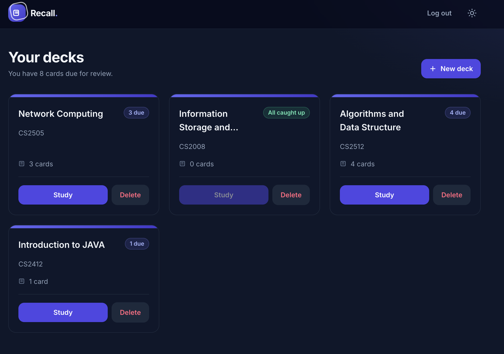
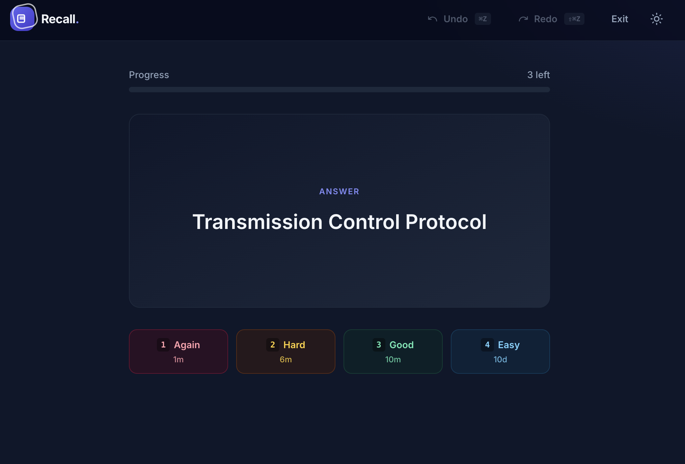
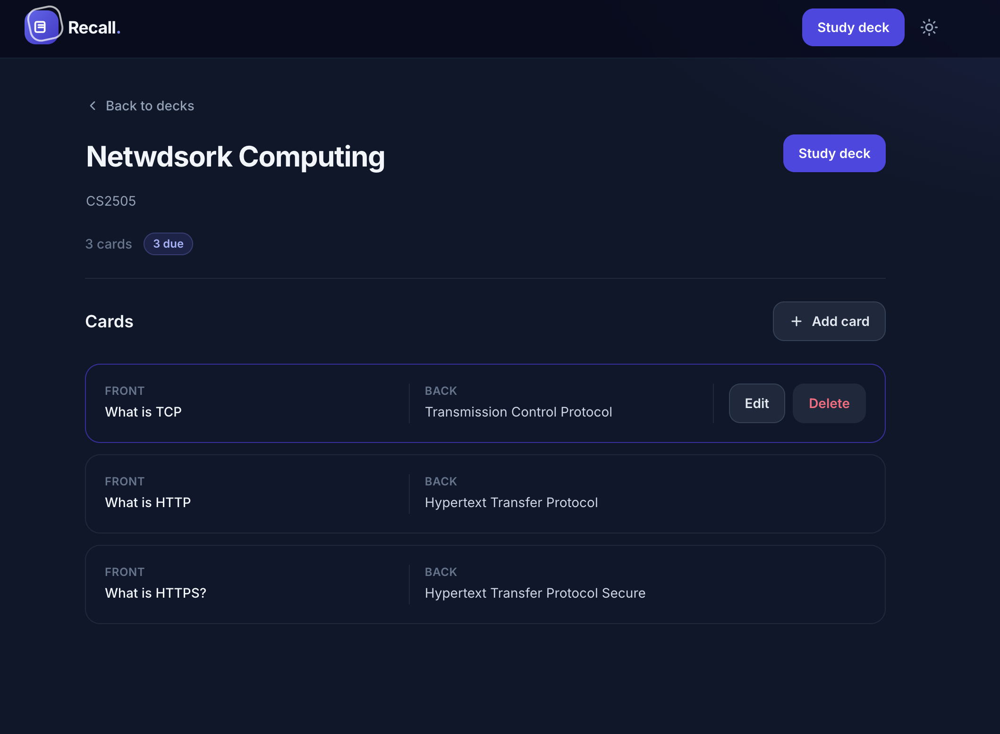
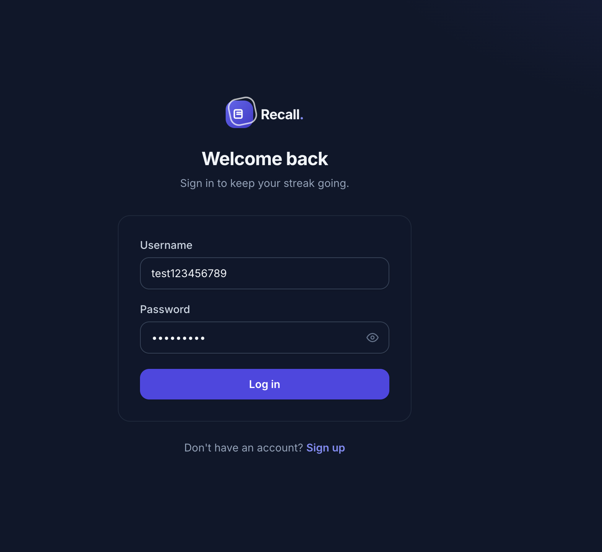
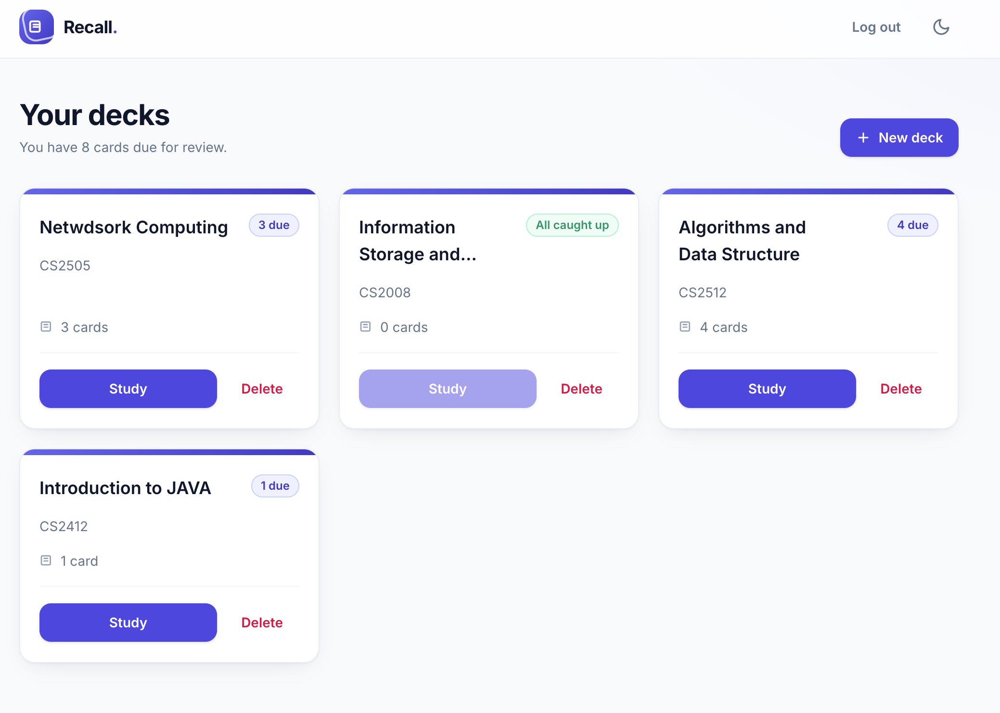

# Flashcards

A spaced-repetition flashcard application built with FastAPI and React. Reviews are scheduled with [FSRS](https://github.com/open-spaced-repetition/py-fsrs), the same algorithm family used by modern Anki, so cards resurface exactly when you are about to forget them.




## Features

- **FSRS scheduling** — every review updates the card's stability, difficulty, and next due date, with per-rating interval previews shown before you answer.
- **Learn-ahead queue** — cards in the learning and relearning states are re-shown within the session instead of disappearing until tomorrow.
- **Undo and redo** — every review is stored as an immutable event, so the last review can be rolled back (and re-applied) without corrupting the schedule.
- **Deck and card management** — create decks, edit names and descriptions inline, and add, update, or delete cards.
- **Optional card images** — attach one image to the front and one to the back of a card. Files are stored on disk and the database only keeps a stable key such as `users/7/cards/<uuid>.webp`; deleting a card or deck removes its files.
- **Authentication and ownership** — JWT auth with Argon2 password hashing; every deck and card is scoped to its owner.
- **Keyboard-first study** — `Space` reveals the answer, `1`–`4` rate the card, `Cmd/Ctrl+Z` and `Cmd/Ctrl+Shift+Z` undo and redo.

## Screenshots

| Study session | Card list |
| --- | --- |
|  |  |

| Login | Light mode |
| --- | --- |
|  |  |

## Tech stack

| Layer | Technology |
| --- | --- |
| Backend | FastAPI, SQLAlchemy 2 (async), Alembic, AuthX, py-fsrs |
| Frontend | React 19, TypeScript, Vite, Tailwind CSS 4, React Router |
| Database | PostgreSQL 17 (via Docker Compose) |
| Testing | pytest with pytest-asyncio, `node --test` |

## Requirements

- Python 3.12+
- Node.js 20+
- Docker (for the PostgreSQL container)
- GNU Make

## Setup

```bash
git clone <repository-url>
cd Flashcards

cp .env.example .env    # then set JWT_SECRET_KEY
make setup              # creates .venv, installs Python deps, runs npm ci
```

Generate a secret key for `JWT_SECRET_KEY`:

```bash
python3 -c "import secrets; print(secrets.token_urlsafe(32))"
```

### Environment variables

| Variable | Description |
| --- | --- |
| `DATABASE_URL` | Async PostgreSQL DSN for the application database. |
| `TEST_DATABASE_URL` | DSN for the test database, created automatically by the container's init script. |
| `JWT_SECRET_KEY` | Secret used to sign access tokens. Use a unique value per environment. |
| `MEDIA_ROOT` | Optional. Directory holding uploaded card images. Defaults to `./media`. |
| `MEDIA_BASE_URL` | Optional. Base URL the API prefixes onto image keys when building response URLs. Defaults to `http://localhost:8000/media`. |

The defaults in `.env.example` match the Docker Compose service, which publishes Postgres on host port `5433`.

## Running the app

```bash
make dev
```

This starts the database container, applies migrations, and runs both servers:

- API — http://localhost:8000 (interactive docs at http://localhost:8000/docs)
- Web app — http://localhost:5173

Sign up at http://localhost:5173/signup to create your first account, then create a deck and add cards.

### Other Make targets

| Command | Description |
| --- | --- |
| `make db` | Start only the PostgreSQL container. |
| `make test` | Run the backend and frontend test suites. |
| `make stop` | Stop the containers. |
| `make reset-db` | Drop the volume, recreate the database, and re-apply migrations. |
| `make revision msg="..."` | Autogenerate an Alembic migration. |
| `make upgrade` / `make downgrade` | Apply or roll back one migration. |

## Testing

```bash
make test              # everything
.venv/bin/pytest tests # backend only
npm --prefix frontend test
```

Backend tests run against `TEST_DATABASE_URL` and manage their own schema, so they never touch development data.

## API overview

| Method | Endpoint | Description |
| --- | --- | --- |
| `POST` | `/signup`, `/login`, `/logout` | Authentication; returns and sets a JWT access cookie. |
| `GET` | `/me` | Current token payload. |
| `GET` `POST` | `/decks` | List or create decks with card and due counts. |
| `GET` `PATCH` `DELETE` | `/decks/{deck_id}` | Read, update, or delete a deck. |
| `GET` `POST` | `/decks/{deck_id}/cards` | List or create cards in a deck. |
| `GET` | `/decks/{deck_id}/study-cards` | Cards due now, including learn-ahead candidates. |
| `GET` `PATCH` `DELETE` | `/cards/{card_id}` | Read, update, or delete a card. |
| `PUT` `DELETE` | `/cards/{card_id}/images/{side}` | Upload (multipart `image`) or remove the image on `front` or `back`. |
| `GET` | `/cards/{card_id}/review-options` | Projected due date and interval for each rating. |
| `POST` | `/cards/{card_id}/review` | Submit a rating (1–4) and advance the schedule. |
| `POST` | `/reviews/{review_id}/undo`, `/redo` | Roll back or re-apply the latest review for a card. |

## Project structure

```
backend/
  main.py            FastAPI app and CORS setup
  models.py          SQLAlchemy models (User, Deck, Card, ReviewEvent)
  routes/            auth, decks, and cards endpoints
  schemas/           Pydantic request and response models
  services/          FSRS scheduling, image storage, auth helpers, hashing
frontend/src/
  pages/             route-level screens, including the study session
  components/        reusable UI (modals, navbar, theme toggle)
  api.ts             fetch wrapper that attaches the access token
  cardImages.ts      card image upload and removal requests
migrations/          Alembic revisions
tests/               pytest suites for auth, decks, and cards
docker/init/         database bootstrap SQL
media/               uploaded card images (git-ignored)
```

## How scheduling works

A card stores its FSRS state (`fsrs_state`, `fsrs_step`, `stability`, `difficulty`, `due`, `last_review`). When you rate a card, the backend asks FSRS for the next state, writes a `ReviewEvent` capturing the full before and after snapshot, and then applies the new values to the card. Undo restores the `before_*` fields and marks the event as undone; redo re-applies the `after_*` fields. Only the most recent review for a card can be undone or redone, which keeps the event log linear.

Cards in the learning or relearning state count as due up to 20 minutes early. This learn-ahead window exists on both sides: the API includes them in `/study-cards`, and the frontend queue in `frontend/src/pages/studyQueue.ts` re-inserts them into the session rather than ending it early.

## How card images work

Text is required on both sides of a card; images are optional extras. Uploads go to `PUT /cards/{card_id}/images/{side}` as multipart form data. The backend ignores the submitted filename and content type, detects the real format from the file's magic bytes, rejects anything that is not a JPEG, PNG, WebP, or GIF, caps uploads at 5 MB, and writes the file to `MEDIA_ROOT/users/{user_id}/cards/{uuid}.{ext}`.

Postgres stores only that key in `cards.front_image_key` / `cards.back_image_key` — never image bytes, Base64, or a pre-built URL. Responses expose `front_image_url` and `back_image_url`, which are generated from the key at serialization time, so the storage location can change without a data migration. Replacing an image, removing one, deleting a card, and deleting a deck all delete the underlying files.

